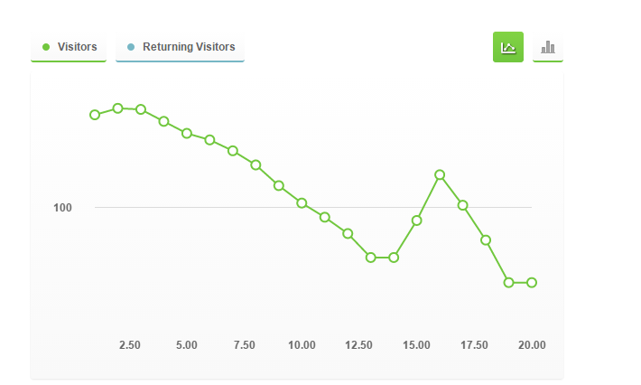

Torque graph viewer
===================

This flow is a viewer for Torque data logged to a CouchDb database (running on a Raspberry Pi).


The node-red flow is:


The db data is structured as JSON:
```
{"total_rows":1307,"offset":0,"rows":[
{"id":"event:1420303457324","key":"event:1420303457324","value":{"rev":"1-5900d13f6f87352488916afb6b22e82d"},"doc":{"_id":"event:1420303457324","_rev":"1-5900d13f6f87352488916afb6b22e82d","Email address":"lesterthomas@hotmail.com","API Version":"7","Device Session ID":"1420295250404","Device ID":"7ac544349106ee1b982bd15a3437e612","Time":"1420297518576","GPS Longitude":"-1.3414394482970238","GPS Latitude":"51.395689216442406","GPS Speed":"2.7021601","GPS bearing":"147.0"}},
{"id":"event:1420303456143","key":"event:1420303456143","value":{"rev":"1-28615faecf01cda864a93563152ffab5"},"doc":{"_id":"event:1420303456143","_rev":"1-28615faecf01cda864a93563152ffab5","Email address":"lesterthomas@hotmail.com","API Version":"7","Device Session ID":"1420295250404","Device ID":"7ac544349106ee1b982bd15a3437e612","Time":"1420297517576","GPS Longitude":"-1.341445567086339","GPS Latitude":"51.395692108199","GPS Speed":"2.4769797","GPS bearing":"138.0"}},
{"id":"event:1420303445097","key":"event:1420303445097","value":{"rev":"1-55cc939be773969d671d9ec2cbc947e1"},"doc":{"_id":"event:1420303445097","_rev":"1-55cc939be773969d671d9ec2cbc947e1","Email address":"lesterthomas@hotmail.com","API Version":"7","Device Session ID":"1420295250404","Device ID":"7ac544349106ee1b982bd15a3437e612","Time":"1420297504576","GPS Longitude":"-1.3414840400218964","GPS Latitude":"51.395697724074125","GPS Speed":"0.67554003","GPS bearing":"195.0"}}
]}
```



The client queries the database for the most recent 20 records and then displays them on a page. It polls the database every second and refreshes the graph.

The Query URL is `http://thethingbox:1880/api/torque_db?querystring=_all_docs%3Fdescending%3Dtrue%26limit%3D10%26include_docs%3Dtrue`


